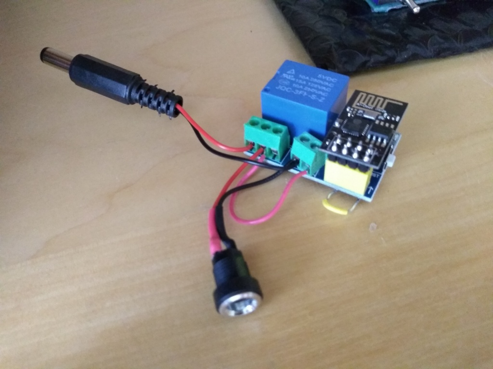
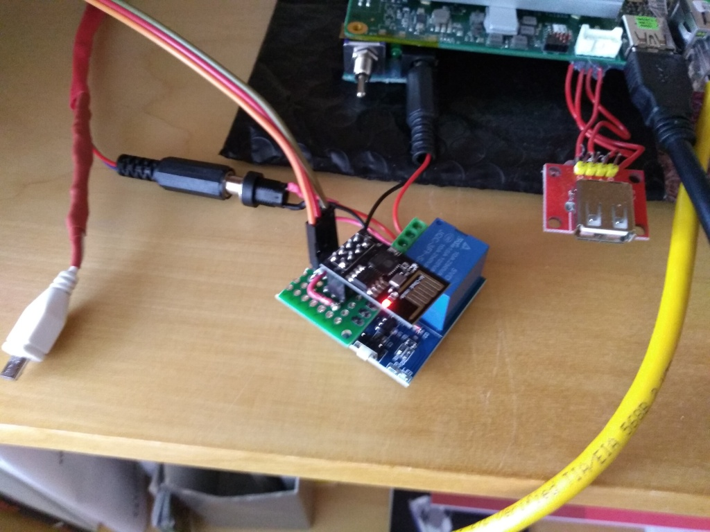
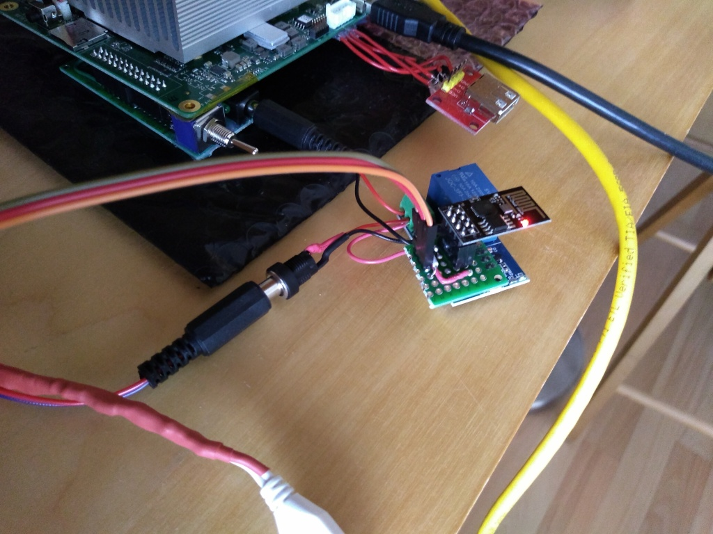
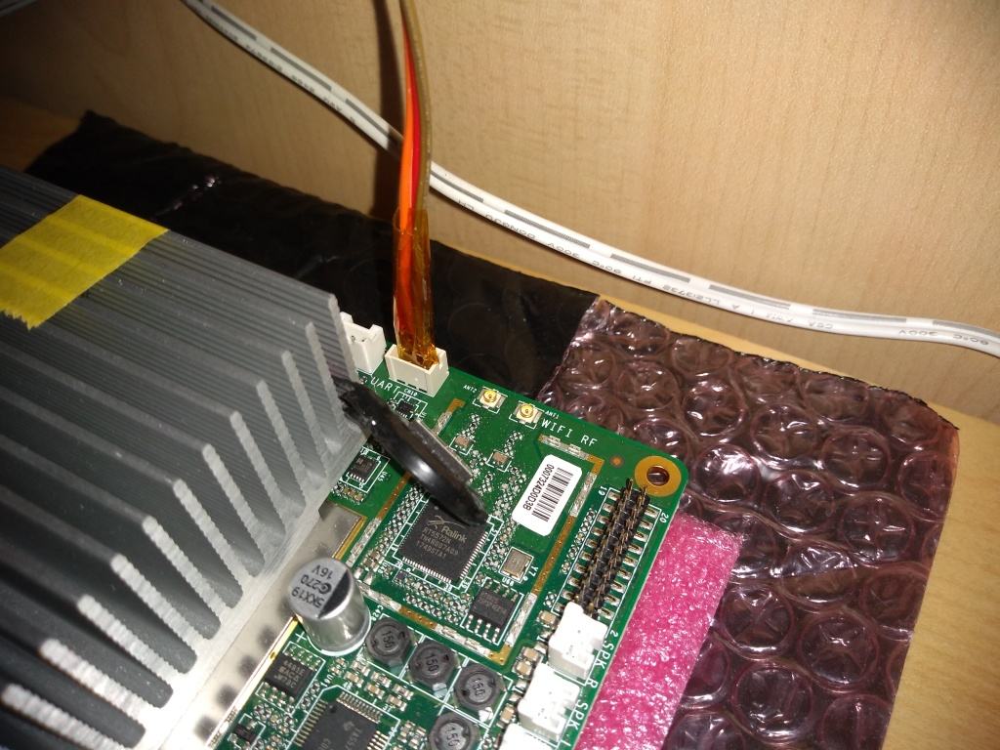

This code allows me to use a dirt-cheap ESP8266/relay module
to remotely control my AtomicPI - as in:

- remote power on/off
- remote serial port, allowing me to fully control its boot process
  (and BIOS)

I wrote a detailed blog post about this [here](https://www.thanassis.space/remotepower.html).

Here are some teaser photos:

And here are two Youtube videos: first, remotely controlling power on/off...

...and then, remotely controling the boot process over the remote serial port:

